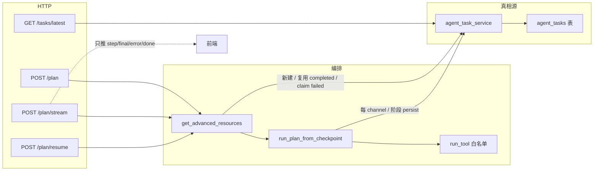

# 长任务状态管理（CE §3.4）— 课上讲解稿

> **状态：已落地**（`agent_tasks` + 进阶资料 plan 检查点续跑）。  
> 总览：[08-CE与MCP.md](./08-CE与MCP.md) §3.4；业务母体：[06-进阶资料推荐.md](./06-进阶资料推荐.md)。  
> 本文面向**讲课**：讲清为什么要做、架构怎么挂、核心代码怎么读，不引入 Redis / Celery / LangGraph。

| 项 | 内容 |
| --- | --- |
| 问题 | 多步 Agent 一跑十几分钟：进程一挂进度没了；SSE 一断前端以为「没跑完」 |
| 解法 | DB 表 `agent_tasks` 当真相源；编排按阶段写检查点；失败可 `resume` |
| 挂接 | 只挂进阶资料 `plan`（`kind=advanced_resources_plan`），不改 `/ask` |
| 课上对照 | 第 30 课 Agent：工具表 + 步进 + **任务状态** |

---

## 1. 为什么要单独做「长任务状态」

进阶资料推荐不是一次 LLM 调用，而是一条**确定性规则路由**：

```text
summarize_weak_points
  → 每个薄弱点：search_course → judge →（可 refine）
                 search_external → judge →（可 refine）
  → analyze_capability → compose_report
```

改造前：

- 结果靠进程内 `_plan_cache[user_id]`；**重启即丢**。
- SSE 边跑边推 `step`；**连接断了，历史只在前端内存里**，服务端没有可续跑的进度。
- 中途工具失败只能整段重跑，课内已经筛过的 keep 也白做。

CE §3.4 要补的就是工业里常见的一句话：

> **流式推送 ≠ 状态存储。** 事件可以丢，任务状态必须可查、可续。

本仓刻意做**最小样例**：不接 Celery、不搞通用 Agent Runtime，只把现成 `plan` 循环改成「可从检查点进入」。

---

## 2. 架构：三层分工



| 层 | 职责 | 关键文件 |
| --- | --- | --- |
| 路由 | 鉴权、参数、`task_id` 回写、SSE 打包 | [`backend/routes/advanced_resources.py`](../backend/routes/advanced_resources.py) |
| 编排 | 从哪个 phase 继续、调哪些工具、何时完成/失败 | [`backend/services/advanced_resources_service.py`](../backend/services/advanced_resources_service.py) |
| 任务存储 | create / checkpoint / complete / fail / latest / resume claim | [`backend/services/agent_task_service.py`](../backend/services/agent_task_service.py) |
| 模型 | `AgentTask` 行结构 | [`backend/models.py`](../backend/models.py) |

**课上口播：** Skill 约束「能调哪些工具」；长任务约束「跑到哪了、断了怎么接」——两者正交。

---

## 3. 实现方案（设计取舍）

### 3.1 状态机（行级 `status`）

| status | 含义 | 下一步 |
| --- | --- | --- |
| `running` | 正在跑 | 写 checkpoint；正常结束 → `completed` |
| `completed` | 跑完 | `refresh=false` 可当「缓存」复用 |
| `failed` | 中断/超时/异常 | `resume` claim 回 `running` 再跑 |

额外约定：

- 同一用户、同一 `kind` **最多一个 `running`**；新建任务时旧 running → `failed` + `error_type=superseded`（**不可** resume，避免双跑）。
- 超过 `agent_task_stale_seconds`（默认 1800）仍 `running` → 标 `stale_running`，允许 resume（覆盖进程崩溃）。

### 3.2 检查点粒度（`state_json` 内进度）

不在「每一步 tool call」强制单独事务（太碎），而在**业务可恢复边界**落盘：

| phase | 何时 persist |
| --- | --- |
| `summarize` | 薄弱点列表确定后 → 进入 `search_topic` |
| `search_topic` | 每个 topic 的课内 channel 完成、课外 channel 完成、切下一个 topic |
| `analyze` / `compose` | 成文两步之后 → `done` |

进度字段（存在 `state_json`）：

- `topic_index`：当前做到第几个薄弱点  
- `course_done` / `external_done`：当前 topic 课内/课外是否已跑完  
- `steps` / `course` / `external` / `report`：已产生的轨迹与结果  

**resume 时：** `if course_done: skip search_course`——这是「阶段续跑」的核心，不是把整个函数从头再执行一遍。

### 3.3 SSE 的角色

```text
真相：agent_tasks.state_json
事件：SSE step / final / error / done
```

- 已有 `completed`：stream 只发 `final` + `done`，**不假装重跑**。  
- 续跑：只对**新产生的** step 推事件。  
- 断线后：前端应 `GET /tasks/latest` 看 status，再决定 `resume`，不要假设 SSE 重连能补齐全部历史。

### 3.4 与旧「进程缓存」的等价语义

| 旧行为 | 新行为 |
| --- | --- |
| `_plan_cache[user_id]` | 最近一条可复用的 `completed` |
| `from_cache=true` | 读自 completed 任务（字段名保留，课上可讲「任务结果」） |
| 空薄弱点不缓存 | `state_has_reusable_result` 为假的 completed 不复用 |
| `refresh=true` 重跑 | 新建 running，supersede 旧 running |

---

## 4. 数据模型

```203:230:backend/models.py
class AgentTask(Base):
    """长任务状态（CE §3.4）；第一期仅进阶资料 plan，状态以 DB 为准。"""

    __tablename__ = "agent_tasks"

    id: Mapped[str] = mapped_column(String(36), primary_key=True, default=lambda: str(uuid4()))
    user_id: Mapped[str] = mapped_column(
        ForeignKey("users.id", ondelete="CASCADE"),
        nullable=False,
        index=True,
    )
    kind: Mapped[str] = mapped_column(String(64), nullable=False, index=True)
    status: Mapped[str] = mapped_column(
        String(32),
        nullable=False,
        default=AgentTaskStatus.running.value,
        index=True,
    )
    step_index: Mapped[int] = mapped_column(Integer, nullable=False, default=0, server_default="0")
    state_json: Mapped[str] = mapped_column(Text, nullable=False, default="{}")
    error_type: Mapped[str | None] = mapped_column(String(64), nullable=True)
    message: Mapped[str | None] = mapped_column(Text, nullable=True)
    # created_at / updated_at ...
```

`state_json` 初始形态由 `empty_plan_state()` 给出（见 `agent_task_service.py`）：把「编排局部变量」序列化进一行，而不是再拆多张步骤子表——MVP 够讲清概念，查询简单。

表随 `Base.metadata.create_all` 创建，无独立迁移框架。

---

## 5. 核心实现怎么读代码

### 5.1 入口分流：`get_advanced_resources`

```704:760:backend/services/advanced_resources_service.py
def get_advanced_resources(
    *,
    user_id: str,
    allowed_spaces: list[str],
    refresh: bool = False,
    resume: bool = False,
    task_id: str | None = None,
    weak_points: list[str] | None = None,
    on_step: StepCallback | None = None,
) -> PlanResult:
    """默认返回最近 completed；refresh 新建；resume 从 failed 检查点续跑。"""
    require_companion_spaces(allowed_spaces)

    if resume:
        # claim failed → running，再 run_plan_from_checkpoint
        ...
    if not refresh:
        cached = get_cached_advanced_resources(user_id)
        if cached is not None:
            return cached

    return plan_recommendations(...)  # 新建任务并从头（phase=summarize）跑
```

课上画三条箭头即可：

1. **读结果** → completed  
2. **重跑** → create + supersede  
3. **续跑** → claim failed + 从 checkpoint 进  

### 5.2 可恢复循环：`run_plan_from_checkpoint`

伪代码对应真实结构：

```text
state = decode(task.state_json)

if phase == summarize:
    得到 topics；persist → search_topic

if phase == search_topic:
    for topic_index ...:
        if not course_done:  search_course+judge; course_done=True; persist
        if not external_done: search_external+judge; external_done=True; persist
        topic_index++; 重置 course/external_done; persist
    phase = analyze

if phase == analyze:  analyze_capability; → compose
if phase == compose:  compose_report; mark completed
```

对应实现片段（课内跳过已完成 channel）：

```506:518:backend/services/advanced_resources_service.py
                if not bool(state.get("course_done")):
                    course_keep, _ = _search_and_judge_channel(
                        topic=topic,
                        channel="course",
                        steps=steps,
                        user_id=user_id,
                        max_steps=search_budget,
                        on_step=on_step,
                    )
                    state["steps"] = steps
                    _accept_course_keeps(state, course_keep)
                    state["course_done"] = True
                    _persist(session, task, state)
```

失败路径：`PlanAborted` 或未捕获异常 → `_fail` → `status=failed`，`state_json` 保留进度，供下次 resume。

### 5.3 任务存储 API（给编排用的原语）

| 函数 | 作用 |
| --- | --- |
| `create_task` | supersede 旧 running + 插入新 running |
| `save_checkpoint` | 写 `state_json` / `step_index` |
| `mark_completed` / `mark_failed` | 终态 |
| `claim_for_resume` | failed → running（拒绝 `superseded`） |
| `latest_completed` | 可复用结果（空结果跳过） |
| `latest_resumable` | 最近可续跑 failed |

单测无真实 Postgres 时，同文件提供 `memory_*` 后备，行为与 DB 路径对齐，避免为讲义另起一套假实现。

### 5.4 HTTP 面

| 方法 | 路径 | 讲解点 |
| --- | --- | --- |
| POST | `/advanced-resources/plan` | `refresh` / `resume` / `task_id`；响应带 `task_id` |
| POST | `/advanced-resources/plan/stream` | 同上；SSE 事件名不变 |
| POST | `/advanced-resources/plan/resume` | 课上演示「断点续跑」的短路径 |
| GET | `/advanced-resources/tasks/latest` | 展示 status / phase / `resumable`，证明 SSE 不是真相源 |

权限：登录用户 + `require_companion_spaces`；`get_task_for_user` 强制 `task.user_id == 当前用户`。

---

## 6. 课上演示建议（15 分钟）

1. **打开表结构 / 模型**：对照 `AgentTask` 字段，问学生「为什么 step 轨迹放 JSON 而不是子表？」（MVP、可演进）。  
2. **跑一次 plan/stream**：看 SSE `step`，同时 `GET /tasks/latest` 看 `step_index` 增长。  
3. **讲检查点**：指着 `course_done` 问「进程在这行之后挂了，resume 会不会再调 search_course？」——单测 `test_resume_skips_completed_course_channel` 就是答案。  
4. **对比 `/ask`**：知识库问答仍是检索 + 拒答，**没有** agent_tasks；长任务只示范旁路 Agent。  
5. **点名不做**：Redis、Celery、LangGraph——避免学生以为「上了状态表就等于完整工作流引擎」。工具运输层见 [15-MCP-Client.md](./15-MCP-Client.md)；跨会话 Memory 见 [14-跨会话Memory.md](./14-跨会话Memory.md)。

相关单测：[`tests/unit/test_agent_tasks.py`](../tests/unit/test_agent_tasks.py)。

---

## 7. 相关代码地图（讲解时按此打开）

```text
backend/models.py                          # AgentTask / AgentTaskStatus
backend/services/agent_task_service.py     # 状态 CRUD + checkpoint + memory 后备
backend/services/advanced_resources_service.py
    get_advanced_resources                 # 分流：复用 / 新建 / resume
    run_plan_from_checkpoint               # 可恢复编排内核
    plan_recommendations                   # 新建任务入口
backend/routes/advanced_resources.py       # HTTP + SSE
backend/schemas.py                         # PlanRequest 增加 resume/task_id；TaskLatestResponse
tests/unit/test_agent_tasks.py             # 续跑跳过、复用、supersede
docs/06-进阶资料推荐.md §5.4               # 产品侧缓存 → 任务表口径
docs/08-CE与MCP.md §3.4                    # CE 总览中的位置
```

---

## 8. 非目标（讲清楚边界）

- 不把 `/ask` 做成可暂停任务  
- 不把 `state_json` / 推荐结果写入 `documents` / `chunks`  
- 不做通用多 kind 调度器（第一期 kind 写死进阶资料）  
- 不引入消息队列；同步线程 + SSE 推事件足够上课演示  

---

## 9. 一句话

**SSE 负责「正在发生什么」，`agent_tasks` 负责「已经到哪了」；进阶资料 plan 按 topic/channel 检查点续跑，这就是本仓 Context Engineering 里的长任务状态管理。**
