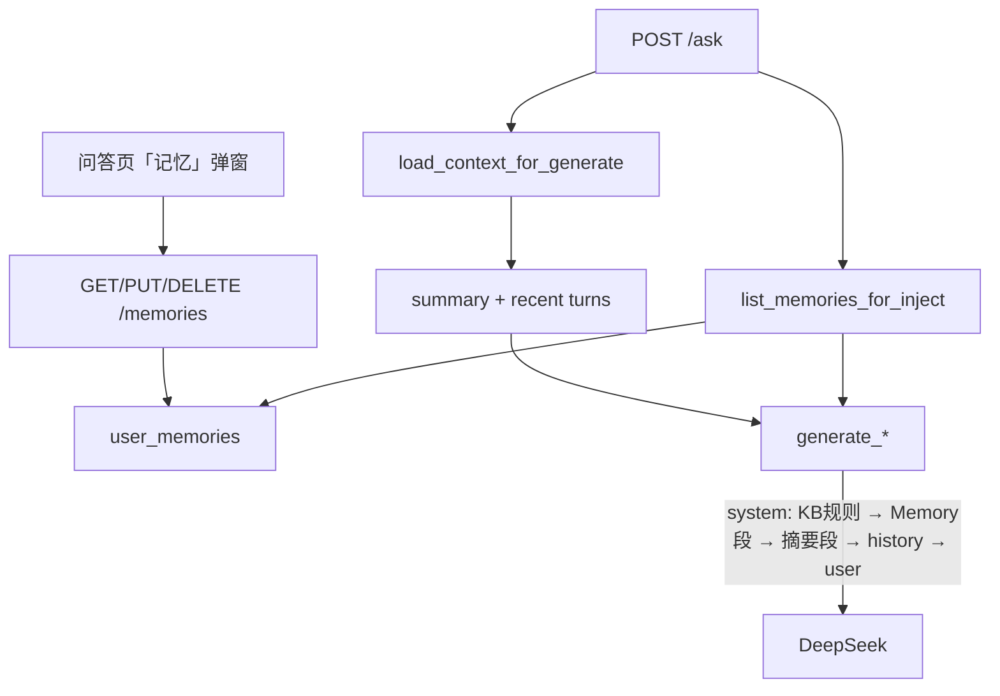

# 跨会话 Memory（CE §3.3）

> **状态：已落地**（`user_memories` + 显式 CRUD + `/ask` 注入 + 问答页「记忆」入口）。  
> 总览：[08-CE与MCP.md](./08-CE与MCP.md) §3.3；同会话压缩见 [07-上下文压缩.md](./07-上下文压缩.md)。

| 项 | 内容 |
| --- | --- |
| 问题 | 新开会话后偏好/约定丢失；近期提问列表不是结构化长期事实 |
| 解法 | 表 `user_memories` 按用户存白名单 key-value；生成前注入独立 system 段 |
| 写入 | **仅显式**（HTTP API + 问答页弹窗）；第一期不做静默 LLM 抽取 |
| 挂接 | 只挂 `/ask`；不进检索 SQL、不进 `sources`/`chunks` |

---

## 1. 为什么要单独做 Memory

| 已有 | 缺口 |
| --- | --- |
| 同会话：`messages` + `context_summary` | 关会话即丢偏好 |
| `list_recent_user_questions` | 非结构化长期事实 |

CE「默认保守」：先显式写入 + 可删 + 注入预算；不做 Mem0 式自动向量记忆。

---

## 2. 架构与数据流



消息组装顺序：

```text
system(问答规则)
system(跨会话记忆 Top-K，若有)
system(本会话滚动摘要，若有)
history(最近 N 轮)
user(本轮依据)
```

检索仍只用当前问 / followup；**Memory 不进 retrieve**。`/ask` 对话**不会**自动抽写入库。

---

## 3. 数据模型与配置

表 `user_memories`：

| 列 | 说明 |
| --- | --- |
| `id` | UUID PK |
| `user_id` | FK → users，索引 |
| `key` | 白名单短键；同用户唯一 `(user_id, key)` |
| `value` | 文本，长度上限 |
| `source` | 第一期仅 `user`；预留 `confirmed_extract` |
| `created_at` / `updated_at` | 时间戳 |

允许的 `key`：

| key | 页面文案 |
| --- | --- |
| `preferred_name` | 称呼 |
| `learning_goal` | 学习目标 |
| `preferred_language` | 偏好语言 |
| `note` | 备注 |

未知 key → 400。

| 配置 | 默认 | 含义 |
| --- | --- | --- |
| `memory_enabled` | true | false 时行为与改造前一致 |
| `memory_inject_max_items` | 8 | 注入条数上限 |
| `memory_value_max_chars` | 500 | 单条 value 上限 |
| `memory_inject_max_chars` | 1500 | 注入正文总字符预算 |

启动 `create_all` 建表即可。

---

## 4. API

| 方法 | 路径 | 说明 |
| --- | --- | --- |
| GET | `/memories/keys` | 允许的 key 列表 |
| GET | `/memories` | 当前用户全部记忆 |
| PUT | `/memories/{key}` | upsert body `{value}` |
| DELETE | `/memories/{key}` | 删除 |

须登录；仅操作 `user_id=自己`。`/ask` 响应**不**回传 memories（用 `/memories` 或页面弹窗对照）。

开发期若用 Vite `:5173`，须在 `frontend/vite.config.ts` 把 `/memories` 代理到后端 `:8000`（与 `/ask` 等同名单）；改代理后需重启 `npm run dev`。同源托管（只开 `:8000` + `npm run build`）无此问题。

---

## 5. 前端入口

| 位置 | 行为 |
| --- | --- |
| 问答页输入栏「记忆」按钮 | 打开 `MemoryDialog` |
| 弹窗 | 列出已存记忆；选 key、填 value、保存 / 删除 |

相关文件：`frontend/src/components/qa/AskComposer.vue`、`MemoryDialog.vue`、`api/memories.ts`；挂在 `QaView.vue`。

---

## 6. 课上演示建议

1. 登录后打开问答页 →「记忆」→ 保存「学习目标」；**新开会话**再提问，看回答是否带上偏好（对照 Memory system 段）。  
2. 换用户登录：B 看不到 A 的记忆。  
3. 指着 `sources`：Memory **不出现**；未命中拒答语义不变。  
4. 非法 key / 超长 value → 400；`memory_enabled=false` → 与改造前一致。  
5. （可选）Swagger / curl 对照同一套 `/memories` API。

---

## 7. 相关代码地图

```text
backend/models.py                         # UserMemory
backend/services/memory_service.py        # CRUD + list_memories_for_inject
backend/infra/generate.py                 # Memory system 段（在摘要之前）
backend/services/qa_service.py            # 有 user_id 时加载注入
backend/routes/memories.py                # HTTP
frontend/src/api/memories.ts
frontend/src/components/qa/MemoryDialog.vue
frontend/src/components/qa/AskComposer.vue  # 「记忆」按钮
frontend/vite.config.ts                   # 开发代理含 /memories
tests/unit/test_memory_service.py
tests/unit/test_generate.py               # 注入顺序单测
docs/08-CE与MCP.md §3.3
```

---

## 8. 非目标

静默自动写入、向量化 Memory、跨用户共享、把 Memory 当第二检索内核、挂进阶资料 plan / MCP、Redis、LangChain Memory 抽象。后续可加「抽取建议 + 用户确认再写入」，不在本切片。
