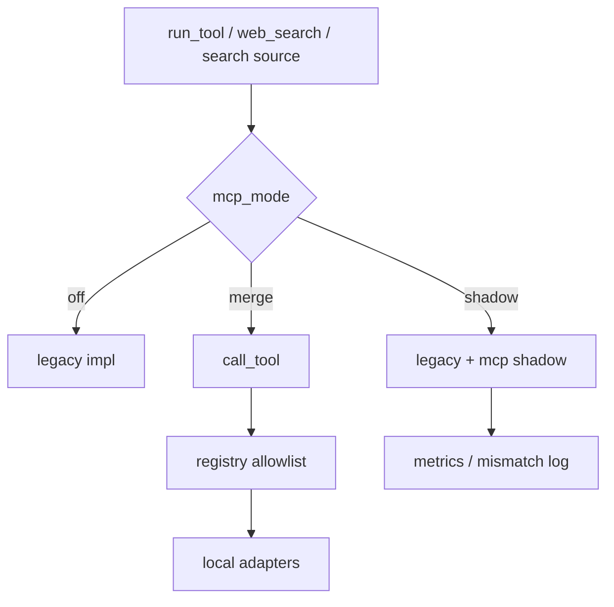

# MCP Client 统一工具调用（CE §4）

> **状态：已落地**（统一调用平台 + local adapter 映射 + `off/shadow/merge` 灰度）。  
> 总览：[08-CE与MCP.md](./08-CE与MCP.md) §4；选型：[04-技术选型.md](./04-技术选型.md)。

| 项 | 内容 |
| --- | --- |
| 定位 | 把可工具化调用收敛到 MCP Client；工具名 / Skill / HTTP 外观不变 |
| 挂接 | `run_tool`、`web_search`、arxiv/tavily 搜索源 |
| 默认 | `mcp_enabled=false` → 行为与改造前一致 |
| 非目标 | MCP Server 产品化、LangChain、改 `/ask` 检索与拒答主链 |

---

## 1. MCP 在本仓是什么

MCP = **模型/Agent 调外部工具的统一插座协议**。

本仓角色是 **Client**：只调用**已登记**工具。第一期用 **local adapter** 把现有实现挂到同一调用层；以后可换 stdio/远程 Server，上层编排不用改。

组合根放在应用层：`backend/services/mcp_tooling.py` 负责把业务 handler 注入 MCP registry；`backend/infra/mcp` 仅保留调用原语（client/registry/adapters/errors/metrics）。

课上金句：**同一调度，换运输协议。**

---

## 2. 覆盖范围

| 纳入 | 入口 |
| --- | --- |
| 进阶资料六工具 | `run_tool` → MCP `invoke_with_mode` |
| `web_search` | `run_general_assist_web_search` |
| arxiv / tavily | `init_open_resource_search_tools` 包装 |

**不改**：`/ask` 向量检索、空间隔离 SQL、未命中拒答、Memory、KB `sources`。

---

## 3. 三模式

| 模式 | 行为 |
| --- | --- |
| `off` | 只跑原实现（默认） |
| `shadow` | 原实现生效；额外跑 MCP，记指标 / 差异日志 |
| `merge` | 走 MCP；失败回退原实现 |

配置（[`backend/config.py`](../backend/config.py)）：

| 项 | 默认 | 说明 |
| --- | --- | --- |
| `mcp_enabled` | false | 总开关 |
| `mcp_mode` | off | off / shadow / merge |
| `mcp_timeout_seconds` | 15 | 单次调用超时 |
| `mcp_allow_servers` | local | 允许的 server 名 |
| `mcp_per_tool_override` | 空 | 如 `search_external=merge,web_search=shadow` |

参数会剥掉 `space_ids` / `allowed_spaces` / `space_id`。

---

## 4. 架构



---

## 5. 课上演示

1. 默认 `MCP_ENABLED=false`：进阶资料 plan / run 与改造前一致。  
2. `.env`：`MCP_ENABLED=true`、`MCP_MODE=shadow`，跑一次 `search_external`，看日志 `mcp_shadow_*`，结果不变。  
3. `MCP_MODE=merge` 或 `MCP_PER_TOOL_OVERRIDE=search_external=merge`：确认仍返回候选，失败不抬成 KB 未命中。  
4. 对照：工具名仍是六件套 + `web_search`，没有 `mcp_*` 新 Agent 工具名。

---

## 6. 代码地图

```text
backend/infra/mcp/
  client.py      # call_tool / invoke_with_mode / resolve_mode
  registry.py    # 登记与 allowlist
  adapters.py    # local 登记
  mapping.py     # 工具名声明 + handler 注册协议（不绑定业务实现）
  errors.py / metrics.py
backend/services/mcp_tooling.py            # 应用层组合根（注入业务 handler）
backend/services/advanced_resources_tools.py  # run_tool 接线
backend/infra/generate.py                    # web_search 接线
backend/infra/open_resource/bootstrap.py     # 搜索源包装
tests/unit/test_mcp_client.py
```

---

## 7. 非目标

Server 运营台、多 server 热发现、把 MCP 当第二检索内核、LangChain、去掉 legacy 分支（需全量 merge 稳定后再评估）。
